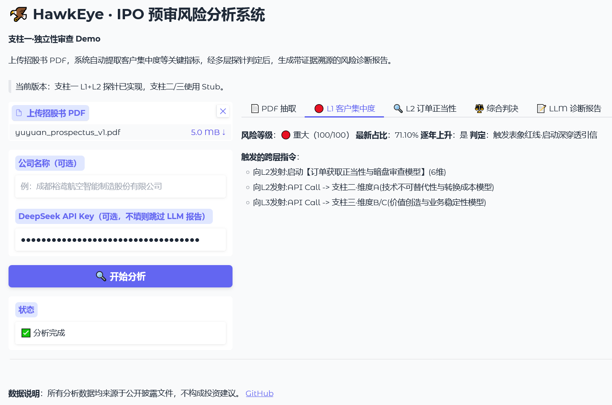
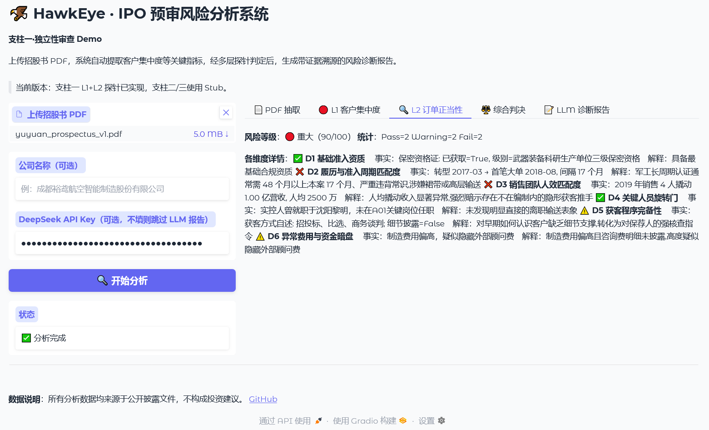
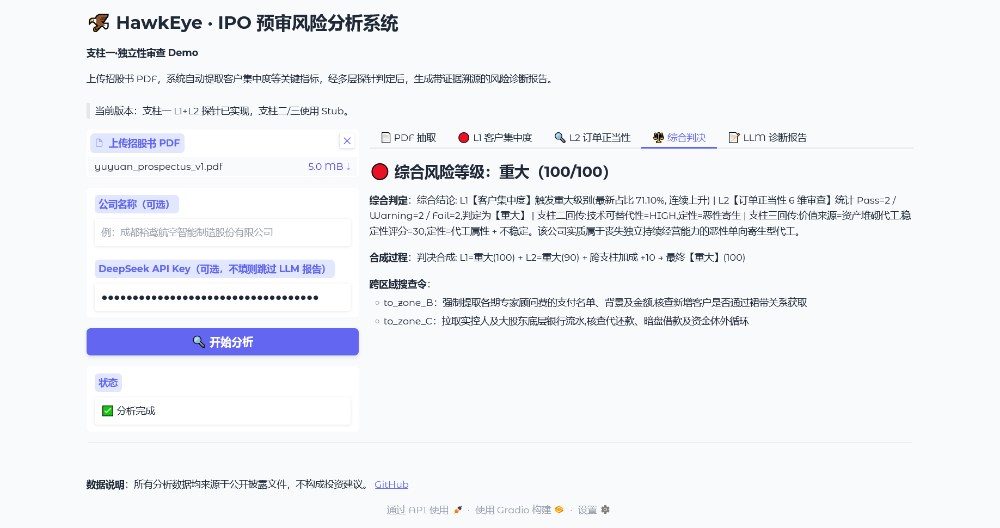
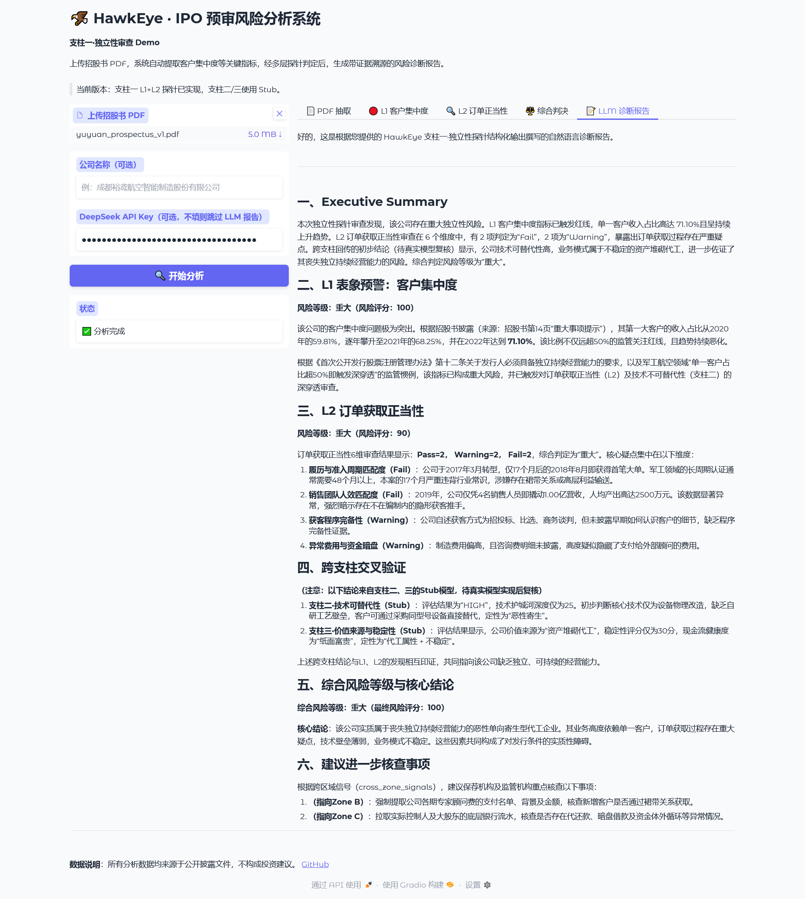

# 裕鸢航空案例研究 v0.1

> 以成都裕鸢航空智能制造股份有限公司（2023 年创业板被否）为解剖样本，验证 TPCL 框架的有效性，并归纳首批推理范式库条目。

------

## 案例背景

→ 成都裕鸢航空，2023 年创业板被否
→ 被否核心原因：深交所上市委的最终否决意见：“发行人业绩增长**严重依赖单一客户**、科研件收入占比逐年下降，**未能充分说明主营业务的成长性**，未能充分说明其是否符合成长型创新创业企业的创业板定位要求。”

------

## TPCL 三柱在裕鸢案例上的映射

官方的否决意见，完美印证了我们 TPCL 闭环的逻辑：独立性丧失（依赖单一客户） → 创新性不足（科研件下滑） → 成长性被绞杀。

**👉 支柱一（独立性与利益输送）：** Agent 抓取到 2020 年暂定价合同占比高达 59.22%。不仅客户集中度畸高，更预警了极其异常的获客方式：如新增客户 Z04 竟是通过“董事长朋友私人关系”获取的，且完全是偶发性交易。

**👉 支柱二（科创属性与伪技术）：** Agent 扫描其核心技术，发现并非底层颠覆创新，而是停留在“三轴铣床升（降）轴改造”这种低维度的设备改造层面。且 2021 年末作为一家号称智能制造的企业，其软件类无形资产（操作与控制软件）账面价值仅 177.59 万元。

**👉 支柱三（抗压与成长性）：** 测算引擎抓取到在利润敏感性测试中，军方单次常规砍价（如下调 20%），即可直接抹去公司当年 1,442.55 万元的净利润，导致绝对净利润蒸发 37.5%，直接击穿监管 30%的重大不利影响红线。

------

## Hawkeye 的预测 vs 发审委的实际追问

🎯 **Agent 探针预警（资金体外循环）：** Agent 在支柱一扫描到董事长朋友控制的 Z04 客户存在利益输送嫌疑，签发跨区域搜查令要求穿透底层资金流水。

💥 **发审委实际追问（完美命中）：** 深交所在第二轮问询函中直接发出致命一击，精准查出：“在康吉森（实控人控制主体）2021年11月已向Z04公司**提供1,000万元借款**的情况下，2021年12月又...向Z04公司**提供资金100万元用于设备采购的合理性**，相关资金往来理由是否真实、完整。”

🎯 **Agent 探针预警（核心技术极易被替代）：** Agent 判定其设备改造技术属于“伪高科技”，随时可能被淘汰。

💥 **发审委实际追问（完美命中）：** 深交所在问询函中直接质问：“同行业是否可直接通过**采购更先进的设备、刀具实现该核心技术可达到的效果**，该核心技术的创新性是否较容易被替代”。

------

## 四色笔记输出示例

> 📌 图片需从本地迁移至 `docs/whitepaper/images/screenshots/` 后路径才能在 GitHub 上正常显示。

**L1：客户集中度**

**L2：订单正当性**

**L3：综合判决**

**LLM 自然语言诊断报告**

------

## 从裕鸢案例归纳出的范式库条目

🔴 Rule 1：【商业地位与议价权定性模型】触发规则

**【If】前端探针扫描到：** 发行人前五大客户高度集中，且交易条款中存在大比例的“先发货后签合同”或“暂定价”结算模式（*如：裕鸢航空 2020 年暂定价合同占比高达 59.22%**，先发货后签合同占比 41.37%*）。

**【Then】系统动作：** 强制挂载 `[商业地位与议价权定性模型]`。

**【Agent 穿透方向】：** 停止常规的财务核算，转而进行商业博弈地位的定性判决，直接将其定性为“毫无议价筹码的弱势依附者”和“价值被收割者”。

🔴 Rule 2：【利润极限压力测试定量模型】触发规则

**【If】前端探针扫描到：** 招股书或问询回复中存在因“审价、暂定价调整”导致的毛利率下滑风险提示。

**【Then】系统动作：** 强制路由分发 `[API Call -> 支柱三（财务测算科）]`，触发 `[利润极限压力测试定量模型]`。

**【Agent 穿透方向】：** 不听信企业“影响较小”的文字辩解，系统自动提取“暂定价风险敞口”与“当期净利润基数”，执行绝对线性测算。撞击 30% 监管红线（*如：测算出暂定价下调 20%，直接导致裕鸢航空利润蒸发 1,442.55 万元**，净利润断崖式下跌 37.5%，直接触发重大不利影响红线*）。

🔴 Rule 3：【资金体外循环与暗盘交易穿透模型】触发规则

**【If】前端探针扫描到：** 新增的大额偶发性客户，其获客渠道异常（如：通过董事长朋友、老客户推荐获取）；或销售人员极少却能撬动数亿军工订单。

**【Then】系统动作：** 签发最高级别跨区域搜查令 `[API Call -> 区域 C（底层资金流水库）]`，触发 `[资金体外循环穿透模型]`。

**【Agent 穿透方向】：** 直接越过虚假的销售合同，死查实际控制人及关联方的底层银行流水，寻找代垫成本或异常借款（*完美复刻发审委思路：查出实控人刘勇涛控制的“康吉森”向董事长朋友控制的新增客户“Z04 公司”暗盘提供 1,000 万元巨额借款的致命实锤*）。

🔴 Rule 4：【科创属性与技术可替代性拷问模型】触发规则

**【If】前端探针扫描到：** 企业主张的“核心技术”大量包含“改造、优化、升级”字眼（*如：三轴铣床升（降）轴改造技术*），且账面软件等无形资产极低。

**【Then】系统动作：** 触发 `[科创属性拷问模型]`。

**【Agent 穿透方向】：** 直接向“技术壁垒”开炮，向企业及保荐人追问：同行业竞争对手是否可以直接通过“购买更先进的设备（五轴加工中心）或刀具”来实现该技术的降维打击和完美替代？撕破其“伪高科技代工厂”的面具。

🔴 Rule 5：【外协依赖与环保合规审查模型】触发规则

**【If】前端探针扫描到：** 核心工序或特种工艺（如表面处理、热处理、真空钎焊）大量采用外协加工模式。

**【Then】系统动作：** 触发 `[外协合规性审查模型]`，跨数据库比对国家环保名录。

**【Agent 穿透方向】：** 自动核查外协供应商是否持有法定的《排污许可证》。一旦发现“未取得排污许可证/未进行排污登记”的供应商（*如裕鸢航空多家供应商存在此问题*），立刻预警“环保违规导致外协厂停产、进而引发发行人生产断供”的系统性经营风险。